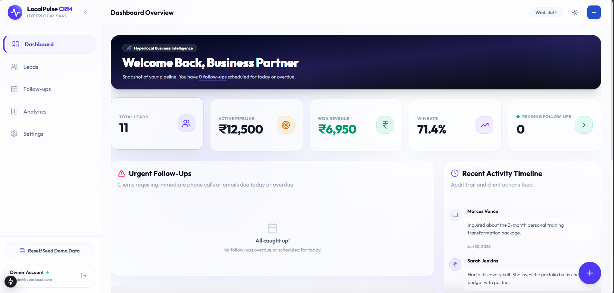
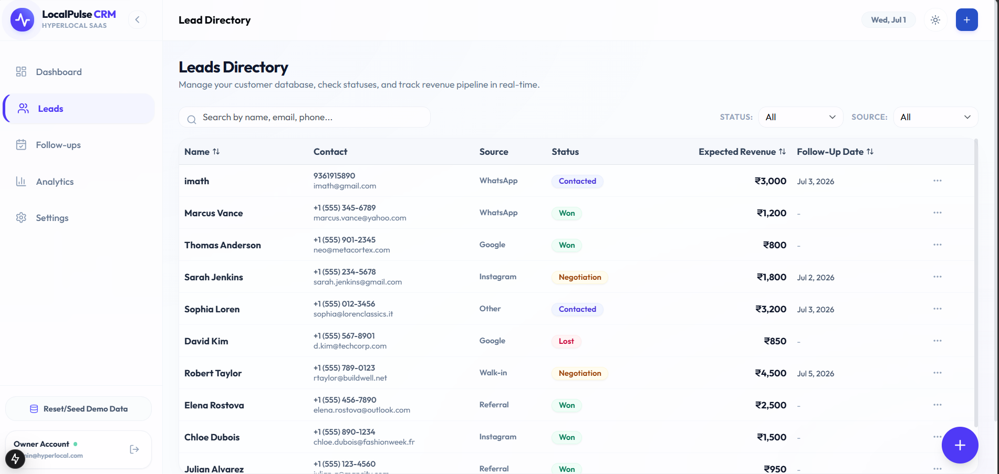
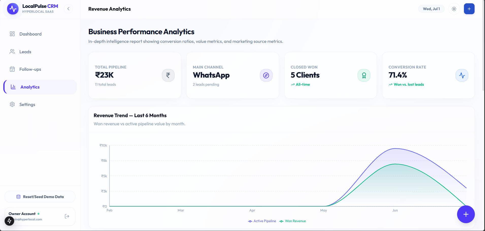
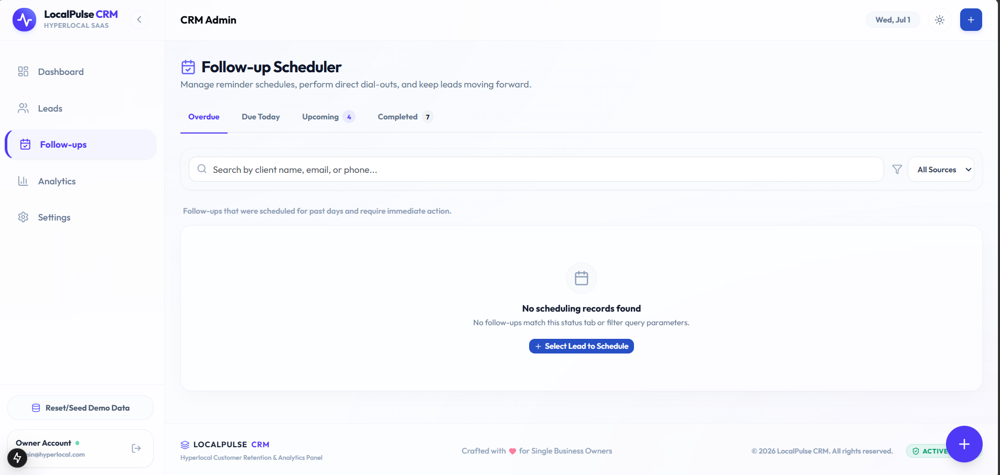
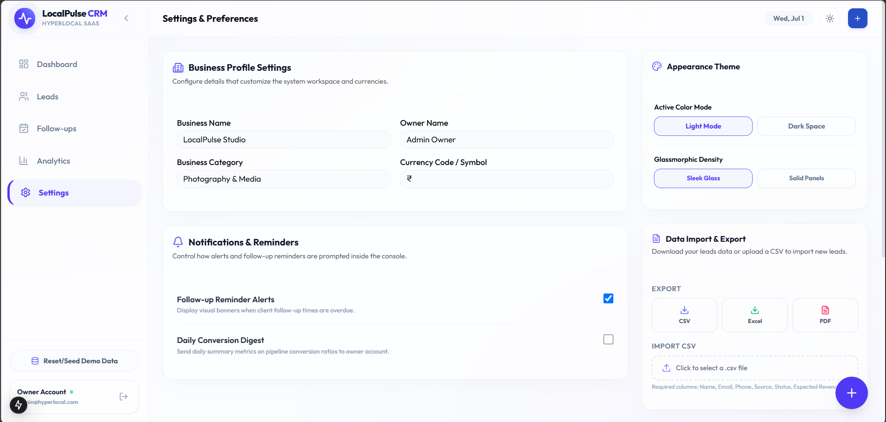
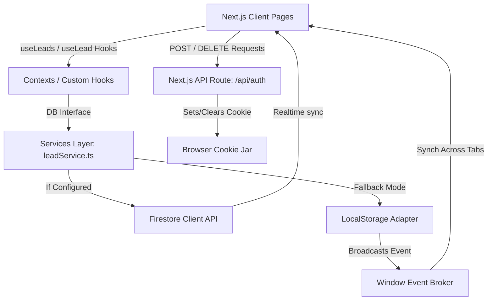

# 📱 Mini Customer Retention & Revenue Dashboard (Project Codename: LocalPulse CRM)

[](https://nextjs.org/)
[](https://react.dev/)
[](https://firebase.google.com/)
[](https://tailwindcss.com/)
[](https://www.typescriptlang.org/)

LocalPulse CRM is a premium, production-level, real-time Customer Relationship Management (CRM) dashboard designed specifically for local and hyperlocal service businesses (e.g., photography studios, personal trainers, catering services, renovation consulting). It streamlines lead tracking, simplifies negotiation, schedules follow-ups, and yields business intelligence insights—all backed by a Firestore database with an automated local storage fallback.

---

## 🔍 Project Overview

LocalPulse CRM exists to solve the **retention and pipeline visibility problems** faced by small, independent business operators.

*   **Why it exists:** Independent business owners often manage client communication across disjointed channels (Instagram DMs, Facebook messages, WhatsApp, Walk-ins) and lose track of follow-ups, leading to lost revenues.
*   **Who will use it:** Small business owners, local studio managers, freelancers, and sales administrators.
*   **Business problem solved:** Prevents lead leakage, quantifies the active pipeline value, tracks marketing channel efficiency, and provides a timeline log of interaction points.
*   **CRM Workflow:**
    ```mermaid
    graph LR
        A[New Lead Capture] --> B[Contacted & Researched]
        B --> C[Negotiation & Counter-Offer]
        C -->|Won| D[Completed Service / Paid]
        C -->|Lost| E[Archive / Review]
    ```

---

## ⚡ Features

### 📊 Welcome Dashboard
*   **Dynamic Welcome Banner:** Greets the owner and showcases a smart reminder count of urgent (today + overdue) follow-ups.
*   **Five KPI Highlight Cards:**
    *   **Total Leads:** Overall lead database count.
    *   **Active Pipeline:** Expected revenue from active deals (`New`, `Contacted`, and `Negotiation`).
    *   **Won Revenue:** Realized revenue from closed-won conversions.
    *   **Win Rate:** Calculated as `Won / (Won + Lost) * 100`.
    *   **Pending Follow-ups:** Interactive alert card linking to follow-ups needing attention.
*   **Urgent Actions List:** Shows the top 5 follow-up reminders requiring immediate email or call.
*   **Distribution Funnel Chart:** A Recharts bar chart showing lead volumes per pipeline stage.
*   **Recent Activity Feed:** An audited timeline of recent changes parsed directly from lead notes with contextual activity badges.

### 👤 Authentication
*   **Credentials Validation:** Fully schema-validated login via React Hook Form and Zod.
*   **Secure API Cookie Sessions:** Custom route handler setting HTTP-only, secure cookies (`crm_session`) to establish active sessions.
*   **Client-Side Route Guarding:** Immediate redirect protection in `AuthContext` to secure all dashboard routes from unauthorized sessions.

### 📋 Lead Management
*   **Real-time Directory Grid:** Displays client profiles, statuses, sources, follow-up alerts, and expected deal sizes.
*   **Custom Search & Debounce:** Instantly search client names, emails, or phone numbers with a built-in 300ms input debounce.
*   **Multi-Attribute Filters:** Filter leads by Pipeline Status and Acquisition Channel.
*   **Sticky Table Header:** Easy navigation through large lead directories with a pinned table header.
*   **Lead Row Actions:** View profile details, edit fields, duplicate client profiles, or delete them.
*   **Empty State Auto-Seeding:** Offers a one-click "Seed Demo Data" prompt if the database is detected empty.

### 🔍 Lead Details
*   **Key Metrics Summary:** Isolated panel tracking expected revenues, source channels, and registration timestamps.
*   **Interactive Negotiation Desk:** For leads marked in the `Negotiation` phase, owners can view client counter-offers and use "Accept Offer" or "Reject Offer" buttons to automatically compute won statuses and document the details.
*   **Activity Timeline Logging:** Form to append context notes directly to the client's historical timeline.

### 📞 Follow-up Management
*   **Categorized Tab Views:** Filter follow-ups by `Overdue`, `Due Today`, `Upcoming`, and `Completed`.
*   **Click-to-Call/Email Shortcuts:** Direct anchors using `tel:` and `mailto:` shortcuts.
*   **Inline Rescheduler:** Quick datepicker to postpone follow-ups, which automatically logs the date update in the lead's history.
*   **"Done" Mark:** Instantly closes pending actions, updating status.

### 📈 Business Analytics
*   **Revenue Trend Area Chart:** A 6-month visual area chart mapping Won Revenue vs. Active Pipeline value.
*   **Proportional Donut Chart:** Visualizes lead acquisition channels with absolute counts and custom legends.
*   **Conversion rate Trend Indicators:** Color-coded badges demonstrating pipeline progression.
*   **Sales Pipeline Funnel:** A custom funnel component scaling stages proportionally by active count.

### ⚙️ Workspace Settings
*   **Business profile editor:** Customize business name, manager profile, and category.
*   **Design Customizer:** Instantly toggle between a "Sleek Glassmorphism" layout and "Solid Panel" cards.
*   **Data Export Suite:** Download active leads data as structured **CSV**, **Excel** (utilizing UTF-8 BOM formatting), or generate a printable **PDF** report via a window print layout.
*   **Data Import Utility:** Upload a custom CSV with client-side header validation and a 5-row preview grid before writing records to database.
*   **Diagnostics Controls:** Seed sample leads or perform a complete database purge.

---

## 🛠️ Tech Stack

| Layer      | Technology            |
| ---------- | --------------------- |
| Frontend   | Next.js 15 (App Router)|
| Language   | TypeScript            |
| Styling    | Tailwind CSS          |
| UI         | shadcn/ui             |
| Database   | Firebase Firestore    |
| Charts     | Recharts              |
| Validation | React Hook Form + Zod |
| Deployment | Vercel                |

---

## 📸 Screenshots

### 📊 Dashboard



---

### 👥 Lead Management



---

### 📈 Analytics Dashboard



---

### 📞 Follow-ups



---

### ⚙️ Settings



---

## 📂 Folder Structure

```text
📁 src
 ┣ 📁 app          # Next.js App Router (Pages, Layouts, APIs)
 ┣ 📁 components   # Feature cards, lists, layout components, and UI widgets
 ┣ 📁 services     # API and DB services integration layer (Firestore / local sessions)
 ┣ 📁 hooks        # Custom hooks containing state managers (useLeads, useLead)
 ┣ 📁 utils        # Data exporters, parsers, and custom date formatters
```

---

## 🏗️ Architecture



### Key Modules:
1.  **Frontend Views:** Built as React Client Components within the Next.js layout structures.
2.  **Auth Context Guard:** A central wrapper (`AuthContext.tsx`) that checks for active session cookies and restricts unauthenticated users.
3.  **Service Adapter Layer:** `leadService.ts` wraps database operations. It checks `isFirebaseConfigured` to switch between Firestore and LocalStorage.
4.  **Local Sync Broker:** If running on LocalStorage fallback, it listens to the `storage` event and a custom `local-leads-updated` event to ensure multiple browser tabs sync data instantly.

---

## 🔥 Firestore Schema

The app stores all customer details in a single root collection:

### `leads` Collection

| Field Name | Type | Description |
|---|---|---|
| `id` | `string` | Unique identifier (UID). |
| `name` | `string` | Customer's full name. |
| `phone` | `string` | Customer's phone number. |
| `email` | `string` | Customer's email address. |
| `source` | `string` | Lead acquisition source (`Instagram`, `Facebook`, etc.). |
| `status` | `string` | Pipeline status (`New`, `Contacted`, `Negotiation`, `Won`, `Lost`). |
| `expectedRevenue` | `number` | Deal size in Indian Rupees (₹). |
| `nextFollowUp` | `string` | Date string formatted as `YYYY-MM-DD`. |
| `notes` | `array` | Array of timeline notes objects: `{ id, content, createdAt }`. |
| `createdAt` | `string` | ISO Date string timestamp. |
| `updatedAt` | `string` | ISO Date string timestamp. |
| `counterOffer` | `number` | *Optional.* Counter-offer value. |
| `counterOfferStatus` | `string` | *Optional.* Counter-offer status (`Pending`, `Accepted`, `Rejected`). |

---

## 🔀 CRUD & Sync Flow

### ➕ Create Lead
*   Method: `createLead(leadInput)`
*   An ID is assigned. Timestamp `createdAt` and `updatedAt` are appended. Optional `initialNote` is formatted as the first element inside the `notes` array. The document is created.

### 📖 Read Leads
*   Method: `subscribeToLeads(callback)`
*   Active real-time listener registers a listener with Firestore using `onSnapshot` ordered by `createdAt` desc. Falls back to LocalStorage in case of errors.

### ✏️ Update Lead
*   Method: `updateLead(id, updates)`
*   Appends updates alongside the updated `updatedAt` timestamp and pushes the patch to Firestore or LocalStorage.

### ❌ Delete Lead
*   Method: `deleteLead(id)`
*   Deletes the target record by ID.

---

## 📊 Analytics Calculations

The business intelligence layer computes statistics on the client-side:

*   **Lead Volume:**
    $$\text{Total Leads} = N_{\text{leads}}$$
*   **Conversion Win Rate:**
    $$\text{Win Rate} = \left( \frac{N_{\text{status: Won}}}{N_{\text{status: Won}} + N_{\text{status: Lost}}} \right) \times 100$$
*   **Revenue Pipeline Value:**
    $$\text{Active Revenue} = \sum \text{expectedRevenue} \quad \text{for leads where status } \in \{\text{'New', 'Contacted', 'Negotiation'}\}$$
*   **Won Revenue:**
    $$\text{Won Revenue} = \sum \text{expectedRevenue} \quad \text{for leads where status} = \text{'Won'}$$
*   **Lead Source Performance:** Calculates total lead counts grouped by `source`.
*   **Overdue & Today Follow-ups:** Filters leads where status is not `Won`/`Lost` and `nextFollowUp` date is $\le$ today's date (comparing dates normalized to UTC).

---

## 🚀 Installation & Setup

Follow these steps to run LocalPulse CRM locally:

### 1. Clone Repository
```bash
git clone https://github.com/your-username/localpulse-crm.git
cd localpulse-crm
```

### 2. Install Dependencies
```bash
npm install
```

### 3. Setup Environment Variables
Create a `.env.local` file in the root directory:
```env
# Firebase Credentials (If left blank, LocalPulse defaults to LocalStorage fallback mode)
NEXT_PUBLIC_FIREBASE_API_KEY=your_firebase_api_key
NEXT_PUBLIC_FIREBASE_AUTH_DOMAIN=your_firebase_auth_domain
NEXT_PUBLIC_FIREBASE_PROJECT_ID=your_firebase_project_id
NEXT_PUBLIC_FIREBASE_STORAGE_BUCKET=your_firebase_storage_bucket
NEXT_PUBLIC_FIREBASE_MESSAGING_SENDER_ID=your_firebase_messaging_sender_id
NEXT_PUBLIC_FIREBASE_APP_ID=your_firebase_app_id

# Single Owner Credentials
DASHBOARD_USERNAME=admin@hyperlocalcrm.com
DASHBOARD_PASSWORD=SecurePassword123!
```

### 4. Run Development Server
```bash
npm run dev
```
Open [http://localhost:3000](http://localhost:3000) on your browser.

---

## 📦 Deployment

### Deploying to Vercel
1.  Push the repository to GitHub.
2.  Import the repository on the Vercel Dashboard.
3.  Add the environment variables listed in `.env.local` to the Vercel project settings.
4.  Click **Deploy**.

---

## ⚖️ Trade-Offs & Decisions

*   **Single-Tenant Architecture:** The application is customized for a single business owner. This simplifies queries and layout logic, avoiding the overhead of multi-tenant workspaces.
*   **Firebase with LocalStorage Fallback:** Allows quick deployments without requiring a database setup first. If Firebase configuration environment variables are missing, the CRM falls back to LocalStorage, making the onboarding process fast.
*   **Cookie-based API Sessions:** Implemented a lightweight `/api/auth` handler using secure browser cookies to avoid the bundle size overhead of Auth0 or NextAuth.
*   **No Role-Based Access Control (RBAC):** Every logged-in user possesses full admin controls. This suits independent businesses but is not suited for large corporate structures.

---

## 🔮 Future Improvements
*   **🧠 AI Lead Scoring:** Incorporate machine learning models to assess lead conversion probability based on historical communication patterns.
*   **📧 Email Automation:** Trigger customized drip campaigns and auto-responses directly inside client cards.
*   **💬 WhatsApp Business API:** Set up interactive chat modules and send automated reminders directly to clients' WhatsApp accounts.
*   **🔔 Push Notifications:** Notify owners instantly on mobile/desktop about upcoming follow-up schedules.
*   **📱 Mobile App:** Native iOS & Android companion applications for managing retention pipelines on the go.
*   **🔐 Role-Based Access Control (RBAC):** Support multi-user accounts (e.g., manager, sales agent, receptionist).
*   **🧾 Invoice Engine:** Build and email invoices directly from Won lead screens.

---

## 👤 Author

*   **Name:** Sathak Irfan
*   **Portfolio:** [https://irfan-next-portfolio.vercel.app]
*   **LinkedIn:** [https://linkedin.com/in/sathak-irfan-9b9557331]
*   **Email:** sathakirfan54@gmail.com

